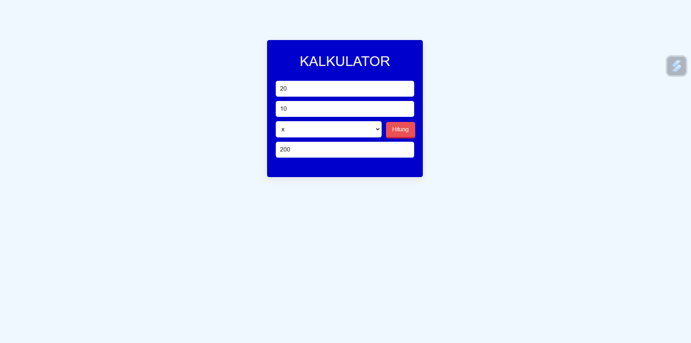

# Kalkulkator

Web kalkulator adalah situs yang memungkinkan pengguna untuk melakukan berbagai perhitungan matematis dengan mudah dan cepat. Situs ini dirancang agar semua orang, dari pelajar hingga orang dewasa, bisa menggunakan kalkulator online ini tanpa perlu mengunduh aplikasi tambahan.

Cara pakainya juga sangat simpel. Kamu hanya perlu masuk ke situs kalkulator, kemudian akan ada beberapa kolom untuk memasukkan angka dan memilih operasi yang ingin dilakukan, seperti penjumlahan, pengurangan, perkalian, atau pembagian. Setelah semua data dimasukkan, cukup tekan tombol "Hitung" dan hasilnya akan langsung muncul di layar.